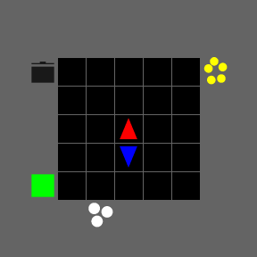

# JAXOvercooked
Implementation of multiple Multi-Agent Reinforcement Learning (MARL) methods on the overcooked environment using JAX.
The benchmark includes two MARL algorithms, as well as 5 CL methods. COOX is the first benchmark designed for Continual Multi-Agent Reinforcement Learning. It is also the first CL benchmark to use JAX, significantly speeding up computation. 



The benchmark includes 36 Overcooked layouts, of varying difficulty level. 


## Install
First create a virtual environment 
``` 
python3.10 -m venv .venv
```

Second, activate this virtual environment:
### Unix systems: 
``` 
source .venv/bin/activate
```
### Windows systems:
``` 
.venv\Scripts\activate.bat
```

Then, install the requirements: 
``` 
pip install -r requirements.txt
```
(for Mac: first remove the [cuda12] in requirements.txt)

Another option is to install with conda:
```
conda create -n jaxovercooked python=3.10
conda activate jaxovercooked
pip install -r requirements.txt
```

## Running IPPO
After installing, the IPPO implementation can be run from the base folder:
```
python -m baselines.IPPO_CL
python -m baselines.IPPO_MLP
```


